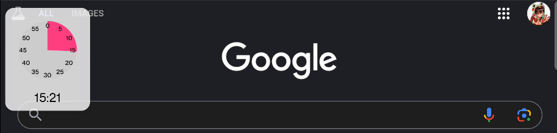

# TimerFriend

*Revolutionizing Time Management with Overlays*

## Overview
TimerFriend is a proof-of-concept Android application that reimagines how we interact with timers in both educational and personal settings. By leveraging Android's overlay system, TimerFriend provides a persistent, visual representation of time that enhances time awareness without monopolizing screen real estate.

## Key Features

### 🎯 Visual Time Representation
- Intuitive pie-chart visualization that shows remaining time at a glance
- Color-coded display for immediate time awareness
- Smooth animations for real-time progress updates

### 💡 Non-Intrusive Design
- Floating overlay that remains visible across all apps
- Drag-and-drop positioning anywhere on screen
- Elegant dismiss gesture with shrink animation
- Minimal screen space usage while maintaining visibility

### 🎓 Educational Benefits
- Helps students visualize time during:
  - Test-taking sessions
  - Reading assignments
  - Group activities
  - Presentation time management
- Enhances time awareness for young learners
- Supports development of time management skills

### 🏠 Home & Personal Use
- Perfect for:
  - Cooking and kitchen timing
  - Exercise intervals
  - Work breaks (Pomodoro technique)
  - Screen time management
  - Meeting time tracking

### 🔧 Technical Innovation
- Voice command integration
- No UI launch required for timer creation
- Efficient memory and battery usage
- Android overlay technology implementation
- Modern Material Design principles

## Why TimerFriend?

Traditional timer applications often require users to switch between apps or occupy valuable screen space. TimerFriend solves these problems by:

1. **Maintaining Context**: Users can see their timer while using other apps
2. **Visual Learning**: Supporting visual learners with intuitive time representation
3. **Accessibility**: Quick timer creation through voice commands or app shortcuts
4. **Flexibility**: Drag-and-drop positioning for optimal placement
5. **Non-Intrusive**: Minimal interference with other activities

## Future Vision

TimerFriend demonstrates the potential for reimagining everyday tools through modern mobile capabilities. Future enhancements could include:

- Multiple concurrent timers
- Custom themes and sizes
- Timer presets for different activities
- Educational templates
- Classroom management features
- Smart home integration

## Technical Requirements

- Android 6.0 (API level 23) or higher
- Permission for overlay display
- Voice command support (optional)

## Getting Started

1. Install the app from the Play Store (coming soon)
2. Grant overlay permission when prompted
3. Create timers via:
   - Voice commands ("Set a timer for 5 minutes")
   - App shortcuts
   - Direct app launch

## Contributing

This is a proof-of-concept project demonstrating the potential of visual overlay timers. We welcome contributions and suggestions for enhancing the educational and practical applications of TimerFriend.
